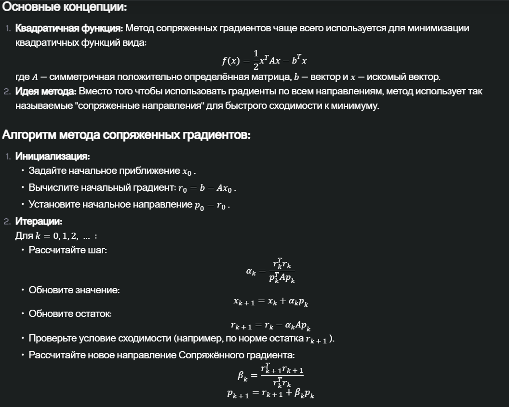

# Минимизация функции

## Общее описание
_____
### Метод градиентного спуска с постоянным шагом
1. **Выбор начальной точки:** 
2. **Определение функции и градиента:** Определите функцию, которую нужно минимизировать, и её градиент, который будет вектором.
3. **Задание шага:** Установите значение шага (постоянный шаг).
4. **Обновление параметров:** На каждой итерации обновляйте значение вектора:
5. **Проверка сходимости:** Проверяйте условие сходимости. Обычно это делается по норме градиента или изменениям в функции:
6. **Повторение:** Повторяйте шаги 4 и 5 до достижения условия сходимости.

### Метод градиентного спуска с переменным шагом (Градиентный метод с дроблением параметра шага)

1. **Выбор начальной точки:** Выберите начальную точку.
2. **Определение функции и градиента:** Определите функцию, которую нужно минимизировать, и её градиент.
3. **Инициализация шага:** Установите начальное значение шага.
4. **Обновление параметров:** На каждой итерации обновляйте значение f(x)и шаг alpha:
   Обновление шага может быть выполнено с использованием различных стратегий:
   - **Дробление:** Уменьшение шага после каждой итерации, например alpha_{n+1} = alpha_n / 2.
   - **Адаптивные методы:** Использование методов, таких как Adam, Adagrad или RMSProp, которые автоматически настраивают шаг.
   - **Метод бэктрекинга:** Поиск подходящего шага, который уменьшает функцию, постепенно его уменьшая.
5. **Проверка сходимости:** Проверяйте условие сходимости.
6. **Повторение:** Повторяйте шаги 4 и 5, пока не достигнете условия сходимости.

### Метод наискорейшего спуска
1. **Определение точки:** 
2. **Определение функции и градиента:** Определите функцию $ f(x) и её градиент grad(fx).
3. **Направление спуска:** Находите направление спуска.
4. **Поиск шага с помощью метода золотого сечения:** С помощью этого метода находите оптимальное значение шага alpha.
5. **Обновление положения:** Обновляйте положение:
   \[
   \mathbf{x}_{n+1} = \mathbf{x}_n + \alpha \mathbf{d}
   \]

6. **Проверка сходимости:** Проверяйте условие сходимости.

7. **Повторение:** Повторяйте шаги 3–6, пока не будет достигнуто условие сходимости.

### Метод сопряжённых градиентов

### Метод Ньютона
Метод Ньютона (или метод Ньютона-Рафсона) — это итеративный метод для нахождения корней функций, который также может быть применён для минимизации функций нескольких переменных. Этот метод использует информацию о градиенте (первых производных) и гессиане (вторых производных) для более точного нахождения точки минимума.

